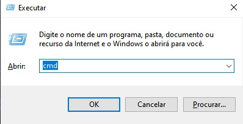
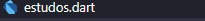
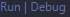

# Instalação e primeiro código em Dart

> # Instalação

## Para conseguirmos programar em Dart, primeiro devemos fazer a instalação do gerenciador de pacotes chocolatey.

- link do tutorial utilizado: <html> <a taget="_blank" href="https://docs.chocolatey.org/en-us/choco/setup#more-install-options">chocolatey</a> </html>.

<html>
<br/>
</html>

># Comandos utilizados:

## Abra o prompt de comando como adimistrador.
## Digite o atalho "super(winkey) + R".
## Digite "cmd" na janela que abrir, e aperte o Atalho "Ctrl + Shift + Enter" para abrir como administrador.
Como representado na imagem abaixo 👇.

<html>
    
</html>

<html>
<br/>
<br/>
<br/>
</html>

## Após abrir o prompt de comando devemos excutar o seguinte comando:

```cmd
    1 | choco upgrade chocolatey
```

Fazendo então a instalação do chocolatey.

## Após isso com o cmd aberto precismos fazer a instalação do dart utlizando os seguintes comandos:

Para instalar:

```cmd
    1 | choco install dart-sdk
```

Para atualizar:

```cmd
    2 | choco upgrade dart-sdk
```

<html>
<br/>
<br/>
<br/>
</html>

> # Configurando o VS code

## Para utilizar a linguagem Dart no VS code, devemos instalar a extensão da linguagem

<html>
<br/>
</html>

## Para instalar a extensão, basta clicar no icone representado pela imagem abaixo e pesquisar pelo nome **"Dart"**

<html>
    
</html>

instalando-a como representado a imagem abaixo:

<html>
    
    
</html>

<html>
<br/>
</html>

> # Programando em Dart

## Para fazer o primeiro código vamos criar um arquivo com o nome que preferir, no caso utilizei "estudos" utilizando o ".dart" no final.
### ex:
    "estudos.dart"

Como representado na imagem abaixo 👇.

<html>
    
    
</html>

># Código

## Como sugerido vamos fazer um simples e clássico print da frase **"Hello World!!"** usando o seguinte código

```dart
main() {
    print("Helo World!!");
}

```

Após isso para "rodar" o código temos duas opções: usar a própria ferramenta _"Run"_ fornecida pelo visual, ou executar via terminal.

- Pelo VS
  Basta clicar **"Run"** no botão como na imagem abaixo

<html>
    
    
</html>

<html>
<br/>
</html>

- Via terminal

  Basta abrir o terminal do próprio VS code e digitar o seguinte comando:

```
    dart Nome do arquivo.dart
```

## Pronto! Com isso, temos o primeiro código em **"Dart"**.
#
># Explicando o código

- ## A função **main()** é o ponto de entrada do programa, ou seja, é o primeiro código a ser executado.

- ## Dentro da função **main()**, temos a chamada da função **print()**, que é responsável por exibir uma mensagem na tela. Nesse caso, a mensagem é a *string* **"Hello World!!"**.

- ## Ao executar o programa, a frase **"Hello World!!"** será exibida na tela, indicando que o código foi executado com **sucesso**.

- ## Esse código é um dos exemplos mais simples e clássicos em programação, muito utilizado para testar se tudo está configurado corretamente.

**Obs: Isto é uma atividade escolar**
#
<html>
<br/>
<br/>
</html>

# Links utilizados

- <a taget="_blank" href="https://docs.chocolatey.org/en-us/choco/setup#more-install-options"> Chocolatey </a>
- <a taget="_blank" href="https://dart.dev/get-dart"> Dart </a>
- <a taget="_blank" href="https://dart.dev/tools/vs-code" > Plugin Dart </a>


# Autor

[<br><sub>Douglas Arthur da Silva Bento</sub>](https://github.com/douglasarthurr)
